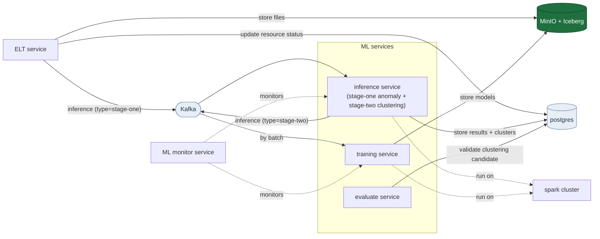

# Image Inference Pipeline (Kafka · MinIO · Postgres · Spark)

An event-driven image-inference stack designed with Hexagonal Architecture. An **ELT**
loads images into object storage and announces them on Kafka with a single **`inference`**
event. One **inference service** consumes that event and runs one of **two stages** based on
the event's `type` field: `stage-one` (PatchCore anomaly detection) scores the image and, for
the confirmed defects, re-publishes the same event as `stage-two`; consuming *that*, it
runs batch defect clustering, which groups the anomalous images into defect types. Both stages
record results in Postgres. Borderline images (the `pending` verdict) leave the automated path
entirely — they are for a human to review.

The two stages run in different places. **Stage-one is distributed**: events are
accumulated into a micro-batch and scored on a **Spark cluster**, where each
Python worker holds its own PatchCore and a `predict_batch_udf` feeds it one
mini-batch at a time. **Stage-two runs in the service process**, because it is a
whole-set clustering that must see every defect image at once.

## Architecture

```
   ELT_INPUT_FOLDER ──► ELT service (bootstrap.elt)
                          │ 1. upload image      ──►  MinIO "images"
                          │ 2. INSERT image row  ──►  Postgres
                          └ 3. publish "inference" (type=stage-one)
                                       │
                                       ▼
                          Kafka topic "inference" ◄────────────────┐
                                       │                           │
                                       ▼            type=stage-two │
   ┌─ inference-service (bootstrap.inference) ────────────────────┐│
   │    routes on event 'type'; hosts the Spark driver            ││
   │                                                              ││
   │  type=stage-one   poll ≤ SPARK_MICRO_BATCH_SIZE events       ││
   │                   dispatch the whole batch ──► [A]           ││
   │                   each anomaly verdict ────────── re-publish ─┘│
   │                                                               │
   │  type=stage-two   two gates, both in-process:                 │
   │                   ≥1000 new since last fit → FIT              │
   │                     whole set + known-good baseline           │
   │                     ResNet50 two-layer clustering             │
   │                     └─► freeze state as a new model version   │
   │                   ≥500 new since last run  → ASSIGN           │
   │                     only the new defects → frozen fit         │
   │                   otherwise → log and return (most triggers)  │
   │                   └─► cluster_results + stage_two_run         │
   └───────────────────────────────────────────────────────────────┘

   [A] Spark executors — 3 worker containers, ≤3 Python workers each
       predict_batch_udf, ≤ SPARK_UDF_BATCH_SIZE images per call:
         MinIO get ─► ResNet50 (ONNX) ─► FAISS ─► buffer-zone verdict
         ─► heatmap PNG              ──► MinIO
         ─► inference_results row    ──► Postgres
         ─► (status, anomaly_score)  ──► back to the driver
       PatchCore built once per Python worker, cached in _STATE
```

### Stage-one inference on Spark

A Kafka `inference` event is the **only** way an image reaches stage-one. The
consumer accumulates those events into a micro-batch (`SPARK_MICRO_BATCH_SIZE`)
and scores the whole batch on the cluster — there is no per-event in-process
path and no separate backlog job.

Spark here is an **execution engine, not the model**. PatchCore is an ONNX
backbone plus a FAISS nearest-neighbour search, and Spark MLlib has no
equivalent of either, so nothing is ported to MLlib — Spark provides the
parallelism, and `predict_batch_udf` feeds the backbone one mini-batch at a time.
The inference-service container never loads the anomaly model at all; it only
hosts the driver.

**What travels to the workers.** Only image *references* — bucket, object key,
content type, size — as a DataFrame. The executor downloads the pixels itself
(overlapping the reads with `SPARK_FETCH_WORKERS` threads), scores them, writes
the heatmap and the `inference_results` row, and returns only the scalar verdict.
Nothing large crosses the driver.

The function that runs on the workers is serialised **by reference**: the task
payload carries `adapters.outbound.spark.scorer` plus a function name, and each
executor imports that module from its own image (`PYTHONPATH=/app`). Two
consequences — the Spark containers need the same MinIO/Postgres variables the
inference service has (configuration is re-read from the executor's environment,
never shipped in a task), and **`spark-app` must be rebuilt whenever the hexagon
changes**, or the executors will quietly run stale code.

**The model is never built on the driver and shipped**: an `InferenceSession` and
a FAISS index are not picklable. `predict_batch_udf` takes a factory, and that
factory resolves through a module-global `_STATE`, so the ONNX session and FAISS
index are constructed once per Python worker process. `spark.python.worker.reuse`
is pinned on, which is what keeps those processes — and therefore the loaded
weights — alive between tasks and between micro-batches. Watch for
`Executor ready: PatchCore model_id=… on cpu (pid=…)`: it should appear once per
Python worker, never once per batch.

**How many copies of the weights exist** is set by task slots, not partitions.
`SPARK_WORKER_CORES` (default 3) caps the concurrent tasks per worker container,
and each concurrent task is one Python worker holding its own model. Partitions
beyond that simply queue and reuse a warm process, so `SPARK_PARTITIONS` is cheap
to raise while `SPARK_WORKER_CORES` is the knob that bounds memory.

**Failure granularity** is per row wherever it can be. A failed download loses
only that image; a failure in the batched forward pass retries the mini-batch
image by image to isolate the culprit; a failed heatmap upload or result insert
is contained to its row. Every row comes back with a verdict *or* an error, and
the batch continues. Note the consequence: a failed image is reported but **not
retried**, and its Kafka offset is committed with the rest.

**Stage-two triggers are emitted by the driver**, once per anomalous image, after
the batch returns — executors never talk to Kafka, so no worker needs broker
access.

## System design (big picture)

The diagram below transcribes `asset/system design.png`, the **target** design.
It extends the currently implemented ELT → inference path (shown above) with a
**training service**, an **evaluate service**, and an **ML monitor service** — all
running batch jobs on the retained **Spark cluster**, driven by ELT storage
events fanned out over Kafka.



> Note: the design document still labels object storage **MinIO + Iceberg**. The
> planned move to Postgres-only result metadata (dropping Iceberg) is tracked
> under [Future optimizations](#future-optimizations).

## Services & ports

| Service             | Purpose                                                | Host port(s)          |
|---------------------|--------------------------------------------------------|-----------------------|
| `kafka`             | Event bus (KRaft, no ZooKeeper)                        | 9092, 29092           |
| `minio`             | S3-compatible object storage                           | 9000 (API), 9001 (UI) |
| `minio-init`        | One-shot: creates `images` + `models`, uploads assets  | —                     |
| `postgres`          | Results store (images, inference & cluster results)    | 5432                  |
| `flyway`            | One-shot: applies `migrations/V*.sql`                  | —                     |
| `elt`               | Image ingest → MinIO → `inference` event (type=stage-one) | —                  |
| `inference-service` | Both stages: consume `inference`, route by `type`; hosts the Spark driver | — |
| `train-service`     | Consume `train` → retrain PatchCore memory bank        | —                     |
| `monitor-service`   | FastAPI dashboard: stage-one results + stage-two clustering health | 8000       |
| `spark-master`      | Spark master; resource allocation only (no driver)     | 7077, 8081 (UI)       |
| `spark-worker-1..3` | Run stage-one; ≤3 Python workers each (`SPARK_WORKER_CORES`) | 8082 / 8083 / 8084 |

`inference-service` **requires a reachable `spark-master` to start** — stage-one
is batch-only and has no in-process fallback, so a broken cluster stops the
service rather than letting it run and silently score nothing.

MinIO console: http://localhost:9001 (default `minioadmin` / `minioadmin`).

## Quick start

```bash
# 1. Build images and start the stack
docker compose up -d --build

# 2. Put .png/.jpg files where the elt service is looking: ELT_INPUT_FOLDER
#    (compose sets it to /app/data, the directory baked into the image; the
#    ./data:/data bind mount is a separate path — see the note below)

# 3. Watch the pipeline work
docker compose logs -f elt inference-service
#    elt:               "Loaded image …" / "Published … event …"
#    inference-service (stage-one): "Saved result … score=0.42 (ANOMALY) …" / "Published stage-two trigger …"
#    inference-service (stage-two): "Clustering N defect image(s) …" / "Saved N cluster result(s) …"

# 4. Inspect the results tables
docker compose exec postgres psql -U "$POSTGRES_USER" -d "$POSTGRES_DB" -c "SELECT * FROM inference_results;"
docker compose exec postgres psql -U "$POSTGRES_USER" -d "$POSTGRES_DB" -c "SELECT * FROM cluster_results;"
```

Stop with `docker compose down` (add `-v` to wipe Kafka/MinIO/Postgres volumes).

## How it flows

1. Place images in `ELT_INPUT_FOLDER`.
   The preloaded images are meant to simulate the workflow of realistic production line.

2. `elt` uploads it to the MinIO `images` bucket, records the image in the
   Postgres `image` table, then publishes an `inference` event (`{event, type,
   bucket, object_key, content_type, size_bytes, created_at}`) with
   **`type=stage-one`** to the `inference` topic, and moves the file to
   `./data/processed`.
3. `inference-service` polls a **micro-batch** of events (up to
   `SPARK_MICRO_BATCH_SIZE`, waiting at most `SPARK_POLL_TIMEOUT_MS`) and
   **routes each on `type`**:
   - **`stage-one`** → the whole batch goes to the Spark cluster as a DataFrame of
     image references. On the executors, each mini-batch is downloaded from MinIO,
     run through PatchCore (ResNet50 ONNX → FAISS), classified through the buffer
     zone (`normal` / `pending` / `anomaly`), rendered as a heatmap into MinIO and
     appended to `inference_results`. Back on the driver, every **`anomaly` or
     `pending`** verdict re-publishes the *same* event with **`type=stage-two`** to
     the same `inference` topic (a self-loop). A publish failure is logged and
     never fails the saved anomaly result.
   - **`stage-two`** → batch-clusters the current defect set (see below) in the
     service process, appending one `cluster_results` row per defect image.

   Kafka offsets are committed **once per micro-batch**, after every event in it
   has been handled (at-least-once). A crash mid-batch replays the whole batch;
   because each result row carries a fresh `event_id`, a replay appends new rows
   rather than colliding, and readers dedupe with
   `DISTINCT ON (object_key) … ORDER BY inferred_at DESC`.

## Stage-two: batch defect clustering

Stage-two groups the *defective* images into defect types. Unlike stage-one it is
**whole-set, unsupervised batch clustering**: a `stage-two` event (an `inference`
event with `type=stage-two`) is only a trigger, and **most triggers do nothing**.
A trigger turns into one of **two** runs, chosen by how much has accumulated:
**assign** every 500 new anomalies (`STAGE_TWO_ASSIGN_COUNT`) projects just those
images through the current version's frozen fit, and **fit** every 1000 since the
last fit (`STAGE_TWO_REFIT_COUNT`) re-clusters the whole set and freezes it as a
new model version. The fit is a faithful port of the validated
`stage-two_experiment/ResNet50_cluster.py` pipeline:

```
recent known-good images ─► ResNet50 Layer2/3 normal prototype (mean/std)
defect set (anomaly only)    ─► per image: anomaly-weighted deep pooling
                                 + compact mask → residual colour (5-d) + shape (5-d)
      ─► block-balanced deep+colour+shape → PCA(0.95) → UMAP → HDBSCAN   (first layer)
      ─► KMeans ecc split of the cut+hole blob                          (second layer)
      ─► cluster_results rows (cluster_id, probability)
```

- **Which images:** `anomaly` only. Stage-one re-emits the event with
  `type=stage-two` for every `anomaly` verdict (`STAGE_TWO_TRIGGER_STATUSES`), and
  the stage-two handler reads the defect set straight from `inference_results`
  (`status = 'anomaly'`), so the event only needs to point back at the image.
- **Why `pending` is excluded:** the buffer zone's uncertain band means "a human
  decides", and it already has its own route — an operator reviews the image in the
  monitor dashboard and can publish a `train` event to retrain the memory bank.
  Feeding unconfirmed images into an unsupervised grouping meant to *name* defect
  types would blur those types, so `pending` is absent from all three places: it
  emits no trigger, is not counted by the gate, and is not clustered.
- **Normal baseline:** the recent known-good images (`status='normal'`) are pulled
  at runtime to build the normal-texture prototype the descriptors are measured
  against — no fixed asset to maintain.
- **Two accumulation gates:** re-clustering the whole set for one new defect
  repeats almost identical work, and doing it often renumbers the clusters, so a
  trigger becomes at most one of two runs. **Assign** — `STAGE_TWO_ASSIGN_COUNT`
  (500) new defects since the last run of either mode — labels only those images
  against the current version's frozen fit. **Fit** — `STAGE_TWO_REFIT_COUNT`
  (1000) since the last *fit* — re-clusters everything and freezes a new version.
  The fit gate wins when both are open. Below both, the handler logs
  `Stage-two assign gate: 37/500 new defect image(s) … waiting` and returns.
  `STAGE_TWO_MIN_BATCH` (15) remains the floor for a meaningful UMAP fit.
- **Results:** one `cluster_results` row per image per run (modelled on
  `inference_results`; join on `image_id`). `cluster_id = -1` means the image
  matched no cluster. **Within one `model_id` the ids are stable** — that is what
  the frozen fit buys — so a defect type keeps its number across every assign. A
  fit mints a new `model_id` and renumbers, so compare ids only within one.
- **Drift signal:** an assign can only place images into clusters that already
  exist, so a genuinely new defect type comes back as `-1`. Each run records its
  own `labelled_count` / `noise_count` / `mean_probability`, and the monitor
  dashboard turns that into a verdict — see
  [Drift: when the clustering stops describing the defects](#drift-when-the-clustering-stops-describing-the-defects).

### How the gates remember (`stage_two_run`)

Both counts are **derived, never stored**: `inference_results` stays the single
source of truth, and a `stage_two_run` row records only how far each finished run
reached, plus which mode it was.

```sql
-- assign gate: since anything last ran
SELECT max(covered_through) FROM stage_two_run WHERE status = 'completed';
-- fit gate: since the clusters were last redrawn
SELECT max(covered_through) FROM stage_two_run
 WHERE status = 'completed' AND mode = 'fit';
-- then, against either watermark
SELECT count(*), max(inferred_at) FROM inference_results
 WHERE status = 'anomaly' AND inferred_at > <that watermark>;
```

**Why two watermarks and not one.** An assign has to advance *something*, or it
would re-label the same 500 images forever. But if it advanced the fit watermark
too, the re-fit count would reset every 500 images and never reach 1000 — the
clusters would never be redrawn and a new defect type could never form a cluster.
Separating them is what makes "assign often, re-fit occasionally" expressible at
all.

Four properties fall out of that shape:

- **A restart resumes.** The accumulation lives in Postgres, not in memory, so
  restarting `inference-service` does not reset progress towards either threshold.
- **A stage-one replay cannot drift it.** There is no counter to increment, so
  re-inserted result rows are simply counted once by the next gate evaluation.
- **A failed or empty run retries.** `covered_through` advances only when a run
  persisted its assignments; a run recorded `failed`, or one where nothing could
  be fetched, leaves the watermark where it was. Deriving the watermark from
  `max(cluster_results.clustered_at)` instead would deadlock exactly there.
- **The bootstrap resolves itself.** Before any fit exists there is no frozen
  state, so `assign` is impossible and every trigger evaluates the fit gate only.
  The first run is therefore always a fit.

`covered_through` is captured *before* the run starts, so results that land during
one (clustering hundreds of images is not instant) count towards the *next* run
rather than being silently skipped by this one.

### What a fit freezes

A fit does not just produce labels — it saves the fitted pipeline as a new
`inference_model` version so later batches can be *assigned* to the same clusters:

| Frozen | Why it must be |
|---|---|
| Normal-texture prototype (Layer2/3 per-channel mu/std) | The deep features are z-scored against it; rebuilding it from today's known-good images would shift the whole space |
| Three block `StandardScaler`s (deep / colour / shape) | They set the relative weight of the blocks |
| `PCA(0.95)` | Projection axes *and* the component count |
| `UMAP` | The 2-D embedding the clusters are defined in |
| `HDBSCAN` (fitted with `prediction_data=True`) | Without that flag `approximate_predict` cannot label a new point at all |
| Second-layer split decision (which cluster, its 1-D KMeans, which side) | This step is a *search*, not a model, so the decision itself has to be recorded |

All of it goes to `{bucket}/{model_type}/{version}/cluster_state.joblib`, written
**before** the registry row so a row never points at a prefix that does not exist.
The artifacts are a pickle, so they are coupled to the pinned `scikit-learn` /
`umap-learn` / `hdbscan` versions — bumping those invalidates existing fits and
forces a re-fit.

**No restart needed.** `fit()` adopts its own result in memory before returning, so
the very next trigger can assign. That matters because the clusterer is a
singleton built once at start-up: without it the running process would keep
`state=None`, never satisfy the assign gate, and re-fit every 1000 images forever.
On an actual restart the builder loads the newest valid version's state from object
storage instead, so both paths end up in the same place.

### Drift: when the clustering stops describing the defects

A frozen fit is only as good as the feature space it was built in. When the line
starts producing a defect type the fit never saw, `assign` cannot invent a cluster
for it — the image comes back `-1`. That makes the unmatched share the drift
signal, and the pipeline **reports it rather than acting on it**: a re-fit
renumbers the clusters but cannot help if the descriptors themselves stopped
separating the defect types. That judgement needs a person.

Every run therefore records how well it went, not just that it happened:

| Column | Meaning |
|---|---|
| `defect_count` | How many **new** anomalies opened the gate. **Not a denominator** — a fit's gate is 1000 while it may label 5000 images |
| `labelled_count` | How many images the run actually gave a `cluster_id` to — the denominator |
| `noise_count` | How many of those came back `-1` |
| `mean_probability` | HDBSCAN membership strength, averaged. Falling means points are landing at the *edges* of clusters — the same drift, earlier |

`monitor-service` compares each assign against the baseline **the fit itself
achieved on the data it was built from**:

```
threshold = max(STAGE_TWO_DRIFT_NOISE_RATIO, fit_noise_ratio × 2)
```

The relative half matters: a fit that legitimately leaves a quarter of its images
as noise would otherwise be reported as drifting from the moment it was created.

The dashboard (http://localhost:8000) gains a **Stage-two clustering** panel:

- a verdict — `unknown` (nothing fitted yet) / `healthy` / `drifting` — with the
  numbers behind it, e.g. `3 of the last 10 assign run(s) exceeded 42% unmatched
  (fit baseline 21%)`
- three accumulation readings — `towards next assign 487`, `towards next re-fit
  912`, `fit baseline unmatched 21.0%` — so an operator can see *why* nothing is
  happening instead of guessing
- the run history: mode, model version, trigger count, labelled, clusters,
  unmatched %, mean probability, duration. A failed run shows a red badge with its
  error in the row tooltip

Served by `GET /api/stage-two/health` and `GET /api/stage-two/runs`. There is
deliberately **no re-fit button**: a drifting verdict is a prompt to review the
clustering algorithm, and automating that away would hide the problem.

### Backbones and validation (ResNet50 now, DINOv2 pending)

The clustering backbone is resolved from the `inference_model` table exactly like
the anomaly model, so validity gates deployment:

- **`resnet50`** is seeded **`is_valid=true`** — the deployed stage-two backbone.
- **`dinov2`** (a batch cosine-memory-bank port of
  `stage-two_experiment/DINOv2_cluster.py`) is seeded **`is_valid=false`** — a
  candidate awaiting the **evaluate-service**. It lives in the code and factory
  but is not built until promoted.

Both backbones are fixed pretrained networks fitted at batch time (pre-downloaded
into the image), so there are no per-version artifacts to upload — promotion is a
one-row change:

```sql
-- once the evaluate-service validates the DINOv2 clusterer
UPDATE inference_model SET is_valid = true WHERE model_type = 'dinov2';
-- switch the backbone and restart the inference service
--   CLUSTER_MODEL_KEY=dinov2  docker compose up -d inference-service
```

Pointing `CLUSTER_MODEL_KEY` at a backbone with no valid version leaves stage-two
clustering disabled — the service still runs stage-one and simply skips stage-two
triggers rather than crashing.

## Project layout

The `inference-service/` codebase follows **Hexagonal Architecture** (Ports & Adapters).
Dependencies point inward only: `adapters → application → domain`. The domain
imports nothing; the application depends only on the domain and the port
interfaces it owns; concrete infrastructure is reached solely in `bootstrap/`.

```
inference-service/              # shared hexagon for ELT + the inference service
  domain/                       # ── Core: entities, zero external deps ──
    models.py                     ImageObject, InferenceEvent (+ StageType),
                                  InferenceResult, ClusterAssignment, ClusterResult
  application/                  # ── Application: orchestration + the ports it needs ──
    ports/
      storage.py                  ObjectStorage
      events.py                   EventPublisher, EventConsumer
      repository.py               ResultRepository
      cluster_repository.py       ClusterResultRepository
      clustering_image_source.py  ClusteringImageSource (defect + known-good sets
                                  + backlog_since for the accumulation gate)
      clustering_runs.py          ClusteringRunLog (the gate's watermark)
      model_registry.py           ModelRegistry (latest + next_minor/register,
                                  so a fit can publish itself as a new version)
      image_repository.py         ImageRepository
      batch_scorer.py             BatchAnomalyScorer (stage-one over a batch)
      model.py                    AnomalyModel (stage-one anomaly) +
                                  ClusterModel (stage-two batch clustering)
      heatmap.py                  HeatmapRenderer
    use_cases/
      ingest_image.py             IngestImage          (ELT use case)
      run_inference.py            RunInferenceUseCase   (stage-one: score_batch + finalise)
      run_stage_one_batch.py      RunStageOneBatch      (stage-one over a batch; emits stage-two)
      run_stage_two.py            RunStageTwo           (stage-two: two gates,
                                                           fit or assign)
  adapters/                     # ── Infrastructure: ports & adapters ──
    inbound/                       driving adapters (entry loops)
      elt_poller.py                 poll a path → IngestImage
      inference_consumer.py         consume 'inference' → route by type:
                                      stage-one → RunStageOneBatch (micro-batch)
                                      stage-two → RunStageTwo
    outbound/                      driven adapters (implement ports)
      factory.py                    ModelFactory (patchcore + resnet50 + dinov2)
      minio_storage.py              ObjectStorage  → MinIO
      kafka_events.py               EventPublisher/EventConsumer → Kafka
      db/                           Postgres adapters, one module per table
        repository.py                 Database (the one pool + transaction/rollback)
                                      + PostgresRepository (base for the adapters)
        images.py                     image             → ImageRepository
        models.py                     inference_model   → ModelRegistry
        inference_results.py          inference_results → ResultRepository (write)
                                      + ClusteringImageSource (read)
        cluster_results.py            cluster_results   → ClusterResultRepository
        stage_two_runs.py             stage_two_run     → ClusteringRunLog
      spark/                        stage-one on the cluster
        scorer.py                     SparkAnomalyScorer (implements
                                      BatchAnomalyScorer) — predict_batch_udf,
                                      per-worker model cache, executor-side I/O
      patchcore/                    PatchCore anomaly-model adapter (stage-one)
        model.py                      PatchCore (AnomalyModel): inference +
                                      inference_batch (stacked forward pass)
        resources.py                  load memory bank + FAISS + ONNX
                                      (+ onnx_providers: cpu / cuda:N)
        builder.py                    build_patchcore (registered in the factory)
        heatmap.py                    MatplotlibHeatmapRenderer
        asset/                        memory_bank.npy, resnet_backbone.onnx(.data)
      resnet50/                     ResNet50 batch clusterer (stage-two, deployed)
        model.py                      ResNet50ClusterModel (ClusterModel):
                                      fit (freezes the pipeline) + assign (replays it)
        descriptors.py                colour/shape mask descriptors (numpy/skimage)
        resources.py                  Layer2/3 extractor + transform
                                      + dump/load/save_state (cluster_state.joblib)
        builder.py                    build_resnet50 — loads this version's frozen
                                      fit if it has one, else fit-only
      dinov2/                       DINOv2 batch clusterer (stage-two candidate)
        model.py                      Dinov2ClusterModel (cosine memory bank)
        resources.py                  torch-hub backbone + intermediate layers
        builder.py                    build_dinov2 (registered; built only if valid)
  config/                       # ── Configuration (read once, at the edge) ──
    settings.py                   env-driven Settings
                                  (Kafka/MinIO/Postgres/ELT/Model/StageTwo/Spark)
    logging.py                    logging setup
  bootstrap/                    # ── Composition roots: the ONLY wiring ──
    elt.py                        python -m bootstrap.elt        (ELT ingest)
    inference.py                  python -m bootstrap.inference  (both stages)
```

The use cases never import an SDK — they speak only to ports. Swapping a model
means adding one adapter (an `AnomalyModel` for stage-one, a `ClusterModel` for
stage-two) and registering its builder in the factory; swapping object storage or
the event bus is the same one-adapter change. The two deployables (`elt`,
`inference-service`) share one hexagon and differ only in their composition root
(`bootstrap/elt.py`, `bootstrap/inference.py`). The inference service itself runs
both stages, dispatching each `inference` event on its `type`.

Every Postgres adapter lives under `adapters/outbound/db/`, one module per table.
`db/repository.py` owns the infrastructure they share: a `Database` that holds
the process-wide connection pool and the borrow → commit → rollback → return
contract, and a `PostgresRepository` base that turns "SQL plus parameters" into a
statement run in one transaction. A table adapter therefore carries only its SQL
and its row mapping. The composition root builds **one** `Database` and injects
it into every repository, so a service opens a single pool and closes it once —
the repositories own no resource of their own. `train-service` and
`monitor-service` repeat the same structure in their own trees; they are separate
Docker build contexts with their own domain models, so the code is mirrored
rather than imported. `monitor-service/db/` holds two query modules —
`inference_results.py` for the stage-one table and `stage_two_runs.py` for the
clustering run log and its drift verdict.

## Configuration

All settings come from environment variables (see `.env` / `.envExample`), read
once in `config/settings.py` and injected inward. Defaults work out of the box
for local use.

**Core** — `KAFKA_TOPIC` / `KAFKA_EVENT_TYPE` (both default `inference`; one
topic carries both stages and the `type` field selects which runs), MinIO
credentials and buckets, the Postgres connection, `ELT_POLL_INTERVAL`, and
`MODEL_NAME` / `MODEL_KEY` (the anomaly model whose version is resolved from
`inference_model`).

**Stage-one on Spark**

| Variable | Default | What it controls |
|---|---|---|
| `SPARK_MASTER_URL` | `spark://spark-master:7077` | Which cluster the driver registers with |
| `SPARK_MICRO_BATCH_SIZE` | 32 | Kafka events gathered per dispatch |
| `SPARK_POLL_TIMEOUT_MS` | 2000 | How long a poll waits to fill that batch |
| `SPARK_PARTITIONS` | 6 | Tasks per batch (**not** model copies) |
| `SPARK_UDF_BATCH_SIZE` | 8 | Images per `predict_batch_udf` call — the mini-batch the backbone sees |
| `SPARK_FETCH_WORKERS` | 8 | Concurrent MinIO reads inside one executor |
| `SPARK_WORKER_CORES` | 3 | Task slots per worker container — the ceiling on concurrent Python workers, and so on PatchCore copies |
| `SPARK_DRIVER_HOST` / `_PORT` / `SPARK_BLOCK_MANAGER_PORT` | `inference-service`, 40001, 40002 | How executors call back to the client-mode driver |
| `MODEL_DEVICE` | `cpu` | `cuda` pins each Python worker to its own GPU (needs an `onnxruntime-gpu` image and Spark GPU resources) |

`SPARK_FETCH_WORKERS` is read on the *worker* (the executor does the fetching),
so it lives in the shared `x-spark-env` block; `SPARK_UDF_BATCH_SIZE` is read on
the driver, where the UDF is built.

**Stage-two**

| Variable | Default | What it controls |
|---|---|---|
| `STAGE_TWO_TRIGGER_STATUSES` | `anomaly` | Verdicts that hand an image to clustering (`pending` goes to human review instead) |
| `STAGE_TWO_ASSIGN_COUNT` | 500 | New `anomaly` images before they are assigned to the frozen fit |
| `STAGE_TWO_REFIT_COUNT` | 1000 | New `anomaly` images since the last fit before the clusters are redrawn |
| `STAGE_TWO_DEFECT_SET_SIZE` | 5000 | Cap on the defect set one fit clusters — keep ≥ `STAGE_TWO_REFIT_COUNT` |
| `STAGE_TWO_NORMAL_SET_SIZE` | 200 | Known-good images used for the normal baseline |
| `STAGE_TWO_MIN_BATCH` | 15 | Floor for a meaningful UMAP fit |
| `CLUSTER_MODEL_KEY` | `resnet50` | Which backbone to build |
| `STAGE_TWO_DRIFT_NOISE_RATIO` | 0.30 | Unmatched share at which the dashboard reports drift (read by `monitor-service`) |

Stage-two has no topic of its own — it reuses the `inference` topic with
`type=stage-two`.

## Future optimizations

The pipeline will move towards **image-centric unsupervised learning** with heavy
image preprocessing and no real columnar/tabular workload. Iceberg (a table format
for columnar analytics) is a poor fit for that direction, so the planned changes are:

- **Drop Iceberg** as a result sink and keep **Postgres** as the single store for
  the small structured result metadata. Image bytes stay in **MinIO** (direct
  key access — no table format needed).
- **Training-data loading:** pack the large number of small image files into
  shard/columnar-ML formats — **WebDataset** (tar shards, streaming) or **Lance**
  (ML-native columnar with random access) — instead of reading millions of
  individual objects.
- **Dataset versioning / reproducibility:** version the images and preprocessing
  outputs on object storage with **lakeFS** or **DVC** so each training run is
  reproducible. (Iceberg only versions tables, not image blobs.)
