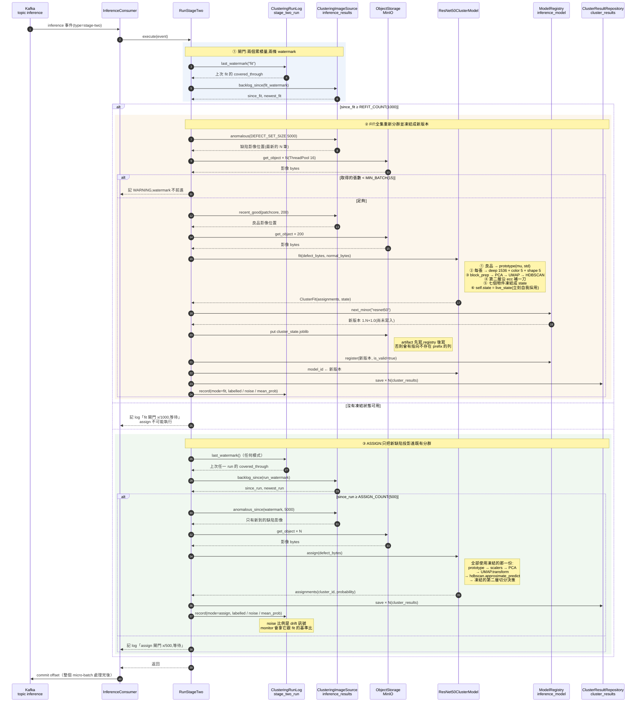
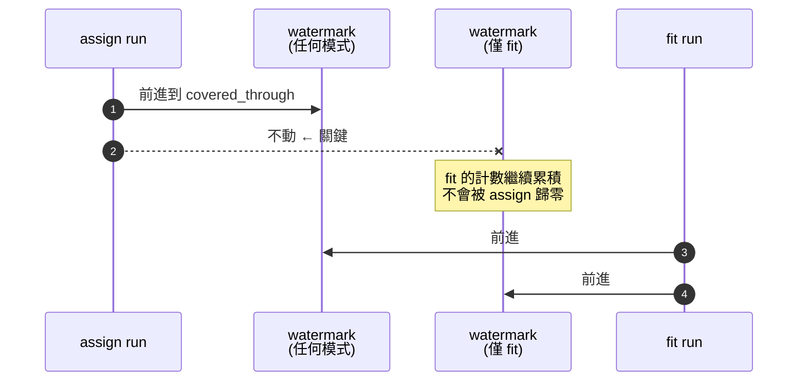

# Stage-two 分群 sequence diagram

`inference-service` 收到 `type=stage-two` 事件後的實際互動。大多數事件只會走到閘門就返回。

## 兩條 watermark 為什麼要分開

`assign` 必須推進「任何 run」那條線,否則會重複歸類同一批。但如果它同時推進 fit 那條,
fit 的計數就會每 500 張歸零一次 —— 永遠到不了 1000,分群永遠不會重畫,新的缺陷型態也就
永遠無法形成新 cluster。

