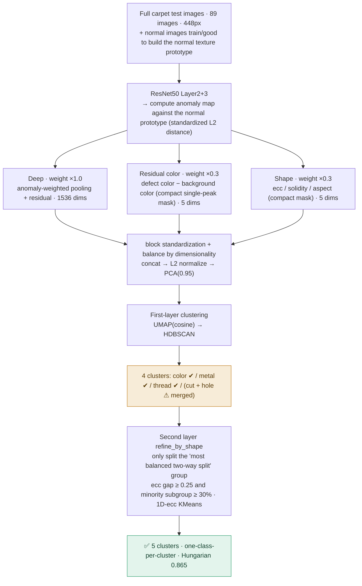
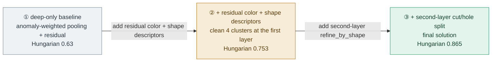

# Two-Layer Defect Clustering Pipeline — MVTec Carpet (Stage 2)

> Full test image → defect-focused features (deep + residual color + shape) → first layer splits into clean four classes → second layer only adds one cut to separate the visually most similar cut/hole.
> **Result: 5 clusters, one-class-per-cluster · Hungarian 0.865 · ARI 0.693 · noise 0% (N=89)**

---

## A. Final pipeline flow

**Key points**

- **No longer using Stage-1 cropped crops**; feed the full images directly, avoiding the scale artifacts injected by crop resizing.
- All three descriptor groups are taken from the **same compact single-peak anomaly map**; residual color (defect − background) is immune to lighting/position.
- Each block is divided by √(dimensionality) then multiplied by its weight, so the 11-dim descriptors are not drowned out by the 1536-dim deep features.
- The second layer only touches the "cut+hole" group, leaving the other three classes untouched.
- Full runnable code is in `ResNet50_cluster.py`.

---

## B. Evolution of the solution

Three stages, adding one feature-engineering item at a time, quantifying each item's contribution:

---

## C. Metric progression

| Stage | Hungarian | ARI | NMI | Purity | # clusters |
|---|---:|---:|---:|---:|---:|
| ① deep-only baseline | 0.63 | — | — | 0.68 | ~5 |
| ② + residual color + shape (first layer) | 0.753 | 0.649 | 0.755 | 0.753 | 4 |
| **③ + second-layer split (final)** | **0.865** | **0.693** | **0.749** | **0.865** | **5** |

*All metrics exclude noise; HDBSCAN's final clustering of the 5 classes has 0% noise.*

---

## D. Key lessons

1. **Global weighting = whack-a-mole.** Boosting the shape weight to split cut/hole also fragments color/thread along "within-class shape variation", and Hungarian drops instead of rising. The fix is to **localize** the hard problem: the first layer settles the four classes, the second layer touches only one group.
2. **Choose the group to split by "split balance", not standard deviation.** Using ecc standard deviation to pick "which group to split" misfires —— color's few outliers inflate the std. A true bimodal (cut+hole) is characterized by being split into **two large halves**, and only the minority-subgroup fraction recognizes it reliably.
3. **Descriptors must be "compact + residual".** Localization was changed to Gaussian-smooth then take the single-peak connected component; color uses the "defect − background" residual. Otherwise the descriptor encodes the background carpet's lighting/position color difference and scatters the once-clean clusters (a pit hit by early versions).
4. **Features first, granularity later.** First use features to separate classes in space, then talk about HDBSCAN granularity. The reverse (coarsening the clustering first) merges the just-separated cut/hole back together.

---

## Residuals and next steps

The `cut` group still mixes about **4 irregularly shaped, high-ecc holes** —— this is an inherent ambiguity of this feature set, already near the ceiling. Breaking through further needs a more fundamental signal: **export the PatchCore anomaly map from Stage-1** as the localization source (far more accurate than the current built-in ImageNet residual map), which would make the shape/color descriptors cleaner. This is a **signal change, not a parameter tweak**.

---

*MVTec carpet · N=89 · ResNet50(layer2+3) · UMAP + HDBSCAN*

## Detailed fine-tuning items and reasons
1. **Why is the original 1024x1024 resized to 448x448?**
    carpet's metal_contamination is a very small dot. At 224, one small dot occupies only about 1 cell —— anomaly-weighted pooling can barely localize it, and the color/shape descriptor mask also blurs. 448 makes the feature map 56×56, so a small defect has 2–3 cells, and localization and mask are finally adequate. 224 is closest to pretraining and fastest, but as the table shows —— it is too coarse for carpet's small defects and sacrifices localization and descriptor quality. Anomaly-detection literature (PatchCore/PaDiM) often uses 256; I raise it to 448 precisely because we additionally build shape/color descriptors that need a finer mask. It is the sweet spot between "seeing small defects clearly enough" and "staying computable and not straying too far from pretraining".
2. **Descriptor design**
    On raw embeddings of ResNet50, metal ↔ thread could never be distinguished, so they kept being merged. On inspection, the data difference is in color/brightness (metal shavings tend to be dark, thread tends to be bright or colored), and ResNet50's extracted features happen to be color-insensitive. So we reasoned back that this descriptor must be able to encode "color/brightness".
