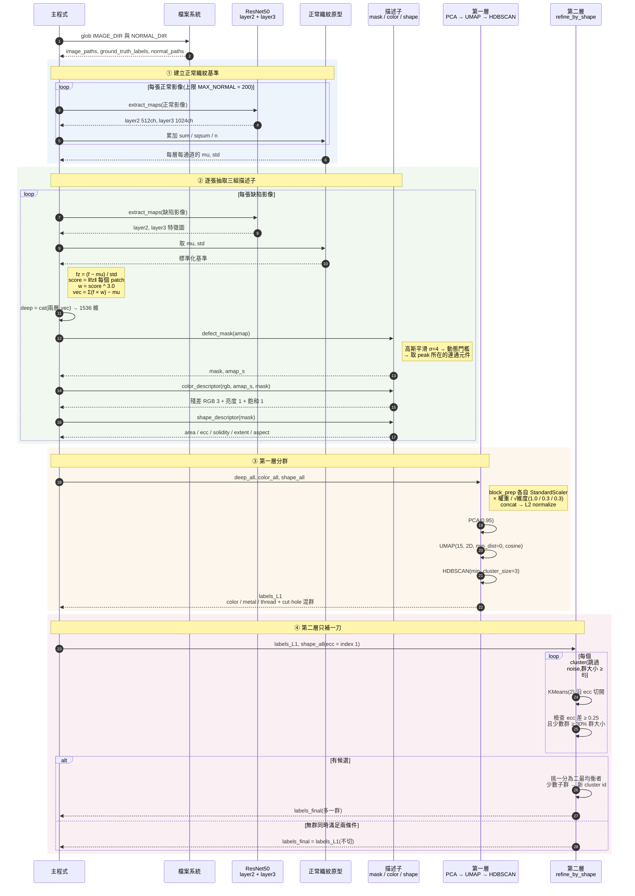

# `ResNet50_cluster.py` 分群流程(sequence diagram)

```mermaid
sequenceDiagram
    autonumber
    participant Main as 主程式
    participant FS as 檔案系統
    participant Net as ResNet50<br/>layer2 + layer3
    participant Proto as 正常織紋原型
    participant Desc as 描述子<br/>mask / color / shape
    participant L1 as 第一層<br/>PCA → UMAP → HDBSCAN
    participant L2 as 第二層<br/>refine_by_shape

    Main->>FS: glob IMAGE_DIR 與 NORMAL_DIR
    FS-->>Main: image_paths, ground_truth_labels, normal_paths

    rect rgb(238, 244, 252)
    Note over Main, Proto: ① 建立正常織紋基準
    loop 每張正常影像(上限 MAX_NORMAL = 200)
        Main->>Net: extract_maps(正常影像)
        Net-->>Main: layer2 512ch, layer3 1024ch
        Main->>Proto: 累加 sum / sqsum / n
    end
    Proto-->>Main: 每層每通道的 mu, std
    end

    rect rgb(240, 248, 240)
    Note over Main, Desc: ② 逐張抽取三組描述子
    loop 每張缺陷影像
        Main->>Net: extract_maps(缺陷影像)
        Net-->>Main: layer2, layer3 特徵圖
        Main->>Proto: 取 mu, std
        Proto-->>Main: 標準化基準
        Note right of Main: fz = (f − mu) / std<br/>score = ‖fz‖ 每個 patch<br/>w = score ^ 3.0<br/>vec = Σ(f × w) − mu
        Main->>Main: deep = cat(兩層 vec) → 1536 維
        Main->>Desc: defect_mask(amap)
        Note right of Desc: 高斯平滑 σ=4 → 動態門檻<br/>→ 取 peak 所在的連通元件
        Desc-->>Main: mask, amap_s
        Main->>Desc: color_descriptor(rgb, amap_s, mask)
        Desc-->>Main: 殘差 RGB 3 + 亮度 1 + 飽和 1
        Main->>Desc: shape_descriptor(mask)
        Desc-->>Main: area / ecc / solidity / extent / aspect
    end
    end

    rect rgb(252, 246, 236)
    Note over Main, L1: ③ 第一層分群
    Main->>L1: deep_all, color_all, shape_all
    Note right of L1: block_prep 各自 StandardScaler<br/>× 權重 / √維度(1.0 / 0.3 / 0.3)<br/>concat → L2 normalize
    L1->>L1: PCA(0.95)
    L1->>L1: UMAP(15, 2D, min_dist=0, cosine)
    L1->>L1: HDBSCAN(min_cluster_size=3)
    L1-->>Main: labels_L1<br/>color / metal / thread + cut·hole 混群
    end

    rect rgb(250, 240, 244)
    Note over Main, L2: ④ 第二層只補一刀
    Main->>L2: labels_L1, shape_all(ecc = index 1)
    loop 每個 cluster(跳過 noise,群大小 ≥ 8)
        L2->>L2: KMeans(2) 沿 ecc 切開
        L2->>L2: 檢查 ecc 差 ≥ 0.25<br/>且少數群 ≥ 30% 群大小
    end
    alt 有候選
        L2->>L2: 挑一分為二最均衡者<br/>少數子群 → 新 cluster id
        L2-->>Main: labels_final(多一群)
    else 無群同時滿足兩條件
        L2-->>Main: labels_final = labels_L1(不切)
    end
    end
```
